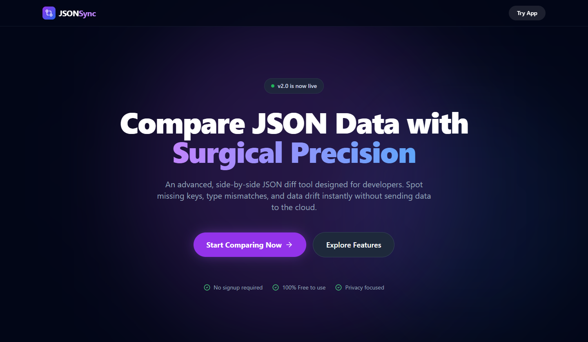
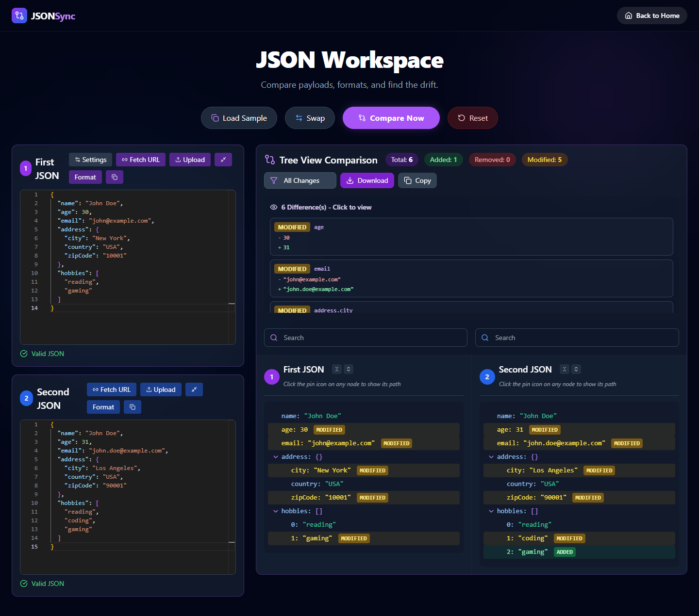

# JSONSync - Advanced JSON Comparator & Diff Tool

<p align="center">
  
</p>

**JSONSync** is a powerful, highly polished web application for comparing JSON objects, visualizing differences with an intuitive nested tree interface, and loaded with features. Everything is beautifully wrapped in a premium dark mode and enhanced with Framer Motion animations.

[**👉 Live Demo Available on Vercel**](https://json-comparator-one.vercel.app/)

## 📸 Comparison View

<p align="center">
  
</p>

## 🚀 Features

### Core Functionality
- **Side-by-side JSON comparison** with detailed difference analysis
- **Real-time JSON validation** internally powered by Monaco Editor catching formatting errors
- **Visual difference categorization**: Additions are green, removals are red, and modifications are yellow
- **Deep object and array comparison** with strict nested path tracking inside intuitive expandable trees

### User Experience
- **Interactive UI**: Gorgeous animated homepage constructed with Framer Motion
- **Drag & drop JSON file support** (.json files) to the respective editors
- **API Fetching**: Quickly fetch JSON data from a remote endpoint URL
- **Sample data loading** to test the system in seconds
- **JSON formatting and minification** toolbar commands
- **Quick Swapping** between the left and right JSON payloads
- **Easily Export/Copy**: Copy exact object property paths (or download the full difference file) to clipboard

### Advanced Operations
- **Deep Node Search**: Find nested values and query keys seamlessly. Matched paths are dynamically highlighted throughout the entire object tree
- **Smart Filtering**: Filter comparison results by specific operation paths (Added, Removed, Modified)
- **Settings Controller**: Adjust numeric precision tolerance and case sensitivity rules during data comparison
- **Privacy First**: Fully local execution; your sensitive JSON data never leaves the browser

## 🛠️ Local Development & Installation

The project uses a standard Create React App workspace layout enriched with React Router and Tailwind CSS.

1. **Clone the repository:**
   ```bash
   git clone https://github.com/your-username/json-comparator.git
   cd json-comparator
   ```

2. **Install dependencies:**
   ```bash
   npm install
   ```

3. **Start the development server:**
   ```bash
   npm start
   ```

4. **Navigate to Local Environment:**
   Open your browser and navigate to [http://localhost:3000](http://localhost:3000) to view the application locally.

## 🏗️ Technology Stack

- **Frontend Framework**: React 19.2.0 + React Router DOM
- **Routing & Navigation**: React-Router-Dom
- **Animations**: Framer Motion
- **Icons**: Lucide React
- **Syntax Highlighter / Input**: React Monaco Editor
- **Styling**: CSS-in-JS powered by Tailwind CSS

## 📊 Comparison Algorithm

The JSONSync tree generation relies on a deeply recursive comparison algorithm that:
1. **Traverses nested objects** and arrays completely to isolate exact discrepancies
2. **Tracks absolute pin paths** for each atomic change (e.g., `user.data.address.city`)
3. **Determines strict equality and handles loose configuration** (e.g. ignoring exact letter casing vs observing numeric sensitivity tolerance settings)
4. Displays the output diff through a fully isolated, robust UI presentation layer

## 🚀 Deployment (Optimized for SEO)
This application includes specialized Meta tags and canonical linking configuration optimized for deployment across Next.js and Vercel environments. 

Automatic CI/CD bindings recommend connecting directly to **Vercel** with the root output set to `/build`.

For manual deployments:
1. **Build the production bundle:**
   ```bash
   npm run build
   ```
2. Upload the output logic directly into your host environment.

## 📝 License

This project is open source and available under the MIT License.
